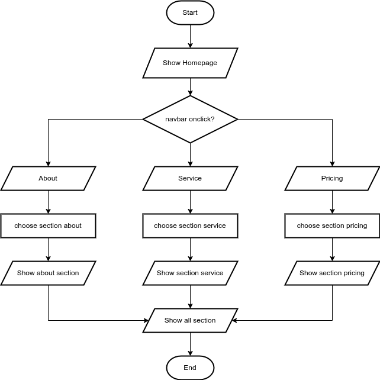

[![Contributors][contributors-shield]][contributors-url]
[![Forks][forks-shield]][forks-url]
[![Stargazers][stars-shield]][stars-url]
[![Issues][issues-shield]][issues-url]

 

<h1 style="font-weight:900" align="center">🧺 LaunDry 🧺</h1>

![underconstruction][underconstruction]

## 🛠️ Apa yang kami kerjakan

  LaunDry adalah mini project dari tugas Studi Independent dari PT Educa Sisfomedia yang membuat sebuah landing page untuk umkm. Dengan kriteria kompetensi yaitu menerapkan alur kerja, teknologi pengembangan, serta finalisasi akhir untuk di presentasikan yang menerapkan branding **Bersih, Rapi, Esktra Wangi**.

### 🚀 Fungsi utama landing page

- **About Us**: Menampilkan terkait tentang umkm yang dimaksudkan atau umkm yang dibuatkan landing page guna membuat umkm lebih menjual.
- **Service** : Service nya sendiri terdapat beberapa macam diantaranya Cuci Kering Pakaian, Cuci Karpet dan Sofa , Cuci dan Setrika,Jasa Antar jemput.
- **Pricing** : Harga terkait dengan service yang diberikan adalah salah satu yang terpenting dalam penjualan jasa.

### ⚙️ Teknologi Pengembangan

- Frontend :

    [![html][html]][HTML-Url]
    [![css][css]][CSS-Url]
    ![javascript][javascript]
    [![bootstrap][bootstrap]][Bootstrap-url]

- Library :

    [![jquery][jquery]][JQuery-Url]

### 📑 Dalam pengerjaan

- **About Us**: Modifikasi responsive for mobile user.

### 🔓 Kontribusi

- Silahkan Fork repository untuk berkontribusi dan pull request dengan format commit seperti contoh.
- `"MP-tanggalBulanTahun: your message commit"`.
- `"MP-30032024: add feature a"`

### Flowchart LP

  

<!-- link -->
[HTML-Url]: https://html.spec.whatwg.org/multipage/
[html]: https://img.shields.io/badge/HTML5-orange?style=for-the-badge&logo=html5&logoColor=white
[CSS-Url]: https://drafts.csswg.org/
[css]: https://img.shields.io/badge/CSS3-blue?style=for-the-badge&logo=css3&logoColor=white
[Bootstrap-url]: https://getbootstrap.com/
[bootstrap]: https://img.shields.io/badge/bootstrap-0F172A?&style=for-the-badge&logo=bootstrap&logoColor=61DAFB
[javascript]: https://img.shields.io/badge/JavaScript-F7DF1E?style=for-the-badge&logo=javascript&logoColor=black
[JQuery-Url]: https://jquery.com/
[jquery]: https://img.shields.io/badge/JQuery-grey?style=for-the-badge&logo=jquery&logoColor=white

[underconstruction]: https://img.shields.io/badge/Status-WIP-FFFF00?style=for-the-badge&logoColor=FFFF00
[contributors-shield]: https://img.shields.io/github/contributors/misnosugianto48/Mini-Project-Gamelab.svg?style=for-the-badge
[contributors-url]: https://github.com/misnosugianto48/Mini-Project-Gamelab/graphs/contributors
[forks-shield]: https://img.shields.io/github/forks/misnosugianto48/Mini-Project-Gamelab.svg?style=for-the-badge
[forks-url]: https://github.com/misnosugianto48/Mini-Project-Gamelab/network/members
[stars-shield]: https://img.shields.io/github/stars/misnosugianto48/Mini-Project-Gamelab.svg?style=for-the-badge
[stars-url]: https://github.com/misnosugianto48/Mini-Project-Gamelab/stargazers
[issues-shield]: https://img.shields.io/github/issues/misnosugianto48/Mini-Project-Gamelab.svg?style=for-the-badge
[issues-url]: https://github.com/misnosugianto48/Mini-Project-Gamelab/issues
